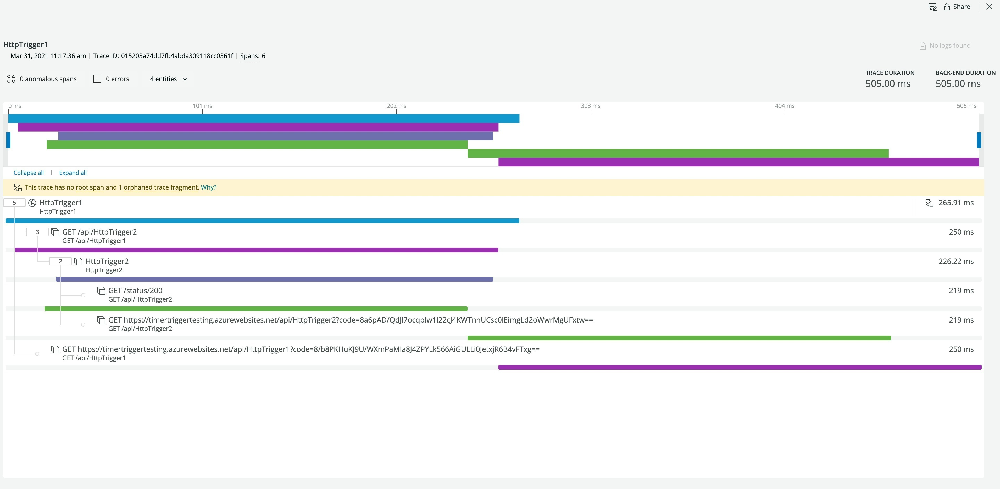

## Node Azure function example

### Function workflow to New Relic:
[HttpTrigger1](HttpTrigger1/index.js) -> [HttpTrigger2](HttpTrigger2/index.js) -> axios request to httpbin.org -> App insights -> Event Hub -> [azureLogIngestion](../../azureLogIngestion/index.ts) -> New Relic

Application inights logs are enabled with their diagnostic settings set to stream Request logs to an event hub. The provided [azureLogIngestion](../../azureLogIngestion/index.ts) function has the [New Relic Telemetry sdk](https://github.com/newrelic/newrelic-telemetry-sdk-node) configured to send azure logs to New Relic as Spans. This ingest function is set up to be triggered by messages placed on the event hub. Logs received by the ingest function are converted into Spans and sent to New Relic.

Example Trace in New Relic:

